# Self-Hosted Bir Social Media Manager Aracı Olarak: CreatorOps

Sosyal medya operasyonları dışarıdan bakıldığında basit görünüyor. Birkaç içerik fikri, birkaç taslak, bir yayın takvimi ve biraz da onay süreci. Ama işin içine ekip büyüklüğü, farklı içerik tipleri, topluluk katkıları, revizyon döngüleri, medya dosyaları ve marka tutarlılığı girince bu süreç hızla dağılabiliyor. Bir noktadan sonra problem içerik üretmek değil, o içeriği düzenli, izlenebilir ve operasyonel olarak yönetilebilir hâle getirmek oluyor.

CreatorOps tam da bu noktada ortaya çıktı aslında. Bu projeyi, Shipin için ve Shipin topluluğunun bugün yaşadığı operasyonel ihtiyaçlar için geliştirdim. Sosyal medya yönetimini tek bir admin paneline sıkıştırmak için değil de content ops tarafını baştan düşünmek için yola çıktım. İçerik planlama, review akışı, public form toplama, form builder, kullanıcı ve rol yönetimi, medya upload’ları ve branding ayarları aynı çekirdekte buluşuyor. Yani amaç yalnızca bir sosyal medya aracı üretmek değil, creator-led ekiplerin kendi işleyişlerini self-host edebilecekleri bir operasyon katmanı kurmaktı.

Bu yazıda CreatorOps’u yalnızca feature listesi olarak anlatmayacağım. Önce hangi problemi çözmek istediğimi, sonra bu problemi hangi mimari kararlarla parçalara ayırdığımı, ardından da sistemin nasıl çalıştığını adım adım anlatacağım. Böylece proje sadece bir ürün değil, aynı zamanda neden bu şekilde tasarlandığını açıkça gösteren teknik bir hikâye hâline gelecek. En azından öyle ümit ediyorum.

## Bu Tool Neden Var?

CreatorOps’u geliştirirken çıkış noktam belli bir ekranı ya da belli bir özelliği çoğaltmak değildi. Asıl mesele, sosyal medya operasyonlarının çoğu ekipte parçalı bir şekilde yürütülmesi. İçerik fikri bir yerde, taslaklar başka yerde, medya dosyaları farklı bir klasörde, onaylar mesajlaşma uygulamasında, topluluk katkıları ise ayrı formlarda yaşıyor. Bu yapı bir süre sonra hem takip edilmesi zor hem de sürdürülebilir olmayan bir akışa dönüşüyor.

Benim çözmek istediğim şey tam olarak buydu: bu dağınık süreci tek bir operasyon yüzeyinde toplamak. Böylece ekipler içerik takibini, review kararlarını, submission toplama akışını ve kullanıcı bazlı yetkilendirmeyi aynı sistemden yönetebilsin istedim. Yani proje bir "dashboard" olmaktan ziyade, içerik operasyonu için çalışan bir çalışma alanı gibi davransın.

Bir başka motivasyon da self-host fikriydi. Bu tip araçların çoğu SaaS mantığıyla tasarlanıyor; ama her ekip verisini dışarıda tutmak istemiyor. Bazıları branding'i değiştirmek istiyor, bazıları kullanıcı akışını kendine göre şekillendirmek istiyor, bazıları da yalnızca kendi PostgreSQL veritabanı ve kendi upload storage'ı üzerinde çalışmak istiyor. CreatorOps bu nedenle Docker, PostgreSQL, Prisma ve local file storage üzerine kuruldu. Yani fikir, "bir ürün" çıkarmaktan çok "kurulabilir bir çekirdek" üretmekti.

Bu bölümden sonra sorun alanını biraz daha somutlaştıracağım. Çünkü proje aslında tek bir feature ile değil, birbirine bağlanan birkaç operasyonel problemi aynı anda çözmeye çalışıyor.

## Shipin Bu Denklemde Nerede Duruyor?

CreatorOps'u genel bir ürün fikri olarak değil, Shipin'in bugünkü ihtiyaçlarından çıkan bir çekirdek olarak düşünmek daha doğru. Shipin tarafında içerik üretimi, topluluk etkileşimi ve yayın operasyonu birlikte ilerliyor. Yani sistem sadece post hazırlamak için değil, topluluktan gelen içeriği toplamak, değerlendirmek, düzenlemek ve yayın akışına sokmak için de çalışmak zorunda.

Bu yüzden çıkış noktası soyut bir SaaS fikri değil, gerçek bir topluluk ve gerçek bir operasyon ihtiyacı oldu. Shipin topluluğunda insanlar içerik öneriyor, bazıları form dolduruyor, bazıları kendi projelerini öne çıkarmak istiyor, bazıları da içerik planına doğrudan katkı veriyor. CreatorOps tam olarak bu hareketi yönetmek için tasarlandı.

Buradaki kullanıcı kitlesi de buna göre şekillendi. Bir tarafta Shipin topluluğundan gelen katkı sahipleri var. Onlar public form üzerinden içerik gönderiyor. Diğer tarafta operasyonu yöneten çekirdek ekip var, onlar review, assignment, form yapılandırması ve branding gibi işleri yönetiyor. Yani ürün aslında iki taraflı bir akış kuruyor. Topluluktan veri toplamak ve o veriyi içerik operasyonuna çevirmek.

Bu bağlamı özellikle önemli buluyorum çünkü proje sadece teknik olarak değil, organizasyonel olarak da bir ihtiyaca cevap veriyor. Bir sonraki bölümde bu ihtiyacı daha net şekilde problem alanına ayıracağım.

## Çözmeyi Planladığım Problem

Bu projede çözmeye çalıştığım ana problem, içerik üretiminin kendisi değil; içerik operasyonunun dağınık kalmasıydı. Bir ekip sosyal medya için fikir üretebilir, taslak yazabilir ve hatta düzenli paylaşım da yapabilir. Ama bu akışın içinde onay mekanizması yoksa, submission'lar ayrı yerde tutuluyorsa, medya dosyaları rastgele klasörlere gidiyorsa ve kullanıcı rolleri net ayrılmamışsa süreç kısa sürede kontrol kaybına dönüşür.

CreatorOps bu dağınıklığı üç temel seviyede çözmeyi hedefliyor. Birincisi, içerik planlama ve review sürecini aynı panelde toplamak. İkincisi, topluluktan veya ekipten gelen içerik katkılarını yapılandırılmış formlar üzerinden almak. Üçüncüsü ise tüm bu akışı self-host edilebilir bir sistemde, tek bir veritabanı ve tek bir upload katmanı üzerinde çalıştırmak.

Benim için problem sadece "bir post hazırlamak" değildi. Asıl problem, o postun hangi aşamadan geçtiğini, kim tarafından gönderildiğini, kimin onayladığını, hangi seriye bağlı olduğunu ve hangi media dosyalarıyla birlikte yaşadığını güvenilir şekilde takip edebilmekti. Yani içerik burada bir varlık; operasyon ise bu varlığın etrafındaki sistem.

Bu yüzden CreatorOps'u bir tasarım aracı ya da basit bir admin paneli gibi değil, editorial workflow ile community submission akışını birleştiren bir operasyon çekirdeği gibi ele aldım. Takvim, formlar, submissions, review ve kullanıcı yönetimi aslında aynı problemin farklı yüzleri. Bir sonraki bölümde de bu probleme hangi teknik mimariyle yaklaşmayı seçtiğimi anlatacağım.

## Teknik Mimari

Bu projede mimariyi özellikle sade tuttum. Amaç, her katmanın ne yaptığının çok net olmasıydı.

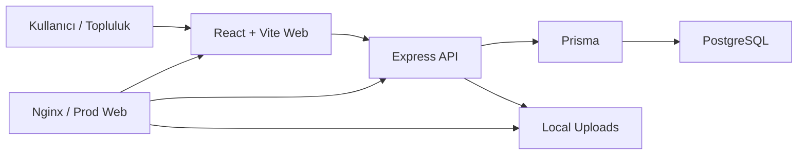

Kısaca akış şu şekilde çalışıyor: frontend sadece arayüzü yönetiyor, iş kuralları API tarafında çözülüyor, veri Prisma üzerinden PostgreSQL'e gidiyor, dosyalar ise local filesystem üzerinde tutuluyor. Production tarafında nginx, web'i servis ediyor ve `/api` ile `/uploads` isteklerini API'ye yönlendiriyor.

Bu yapı bana iki şey sağladı: self-host kurulumunun kolay olması ve domain mantığının tek yerde kalması. Bir sonraki bölümde bu mimarinin üstünde duran ana feature setini, çok uzatmadan tek tek gezebiliriz.

## İçerik Takvimi

CreatorOps'un en görünür parçalarından biri içerik takvimi. Burada amaç, bir post'u sadece yazmak değil, hangi güne gideceğini, kime atanacağını ve hangi aşamada olduğunu tek ekrandan görmek.

Takvim görünümü ekip için günlük operasyon ekranı gibi çalışıyor. Hangi gün hangi içerik planlanmış, hangi post review bekliyor, hangisi tamamlanmış, bunların hepsi hızlıca okunabiliyor. Bu da özellikle küçük ekiplerde ayrı araçlar arasında gidip gelme ihtiyacını azaltıyor.

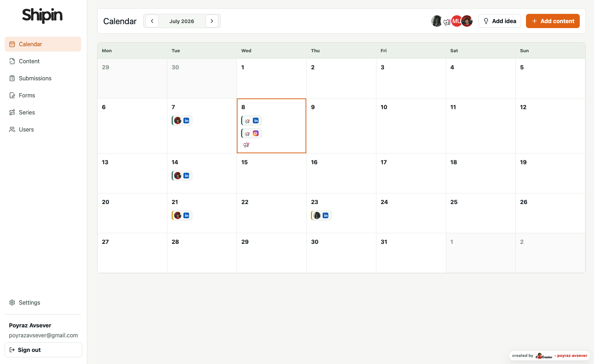

Bu bölüm aslında sistemin kalan kısmı için temel oluşturuyor. Çünkü aynı içerik mantığı daha sonra content list, submissions ve review ekranlarında da devam ediyor.

## İçerik Listesi ve Review

Takvimin yanında bir de operasyonel liste görünümü var. Bu ekran, ekibin o anki içerik stokunu net şekilde görmesini sağlıyor.

Burada en önemli şey sadece içeriği görmek değil; durumunu okumak. Draft, pending review, approved veya revision requested gibi statüler sayesinde ekip hangi içeriğin hangi aşamada olduğunu hemen anlıyor.

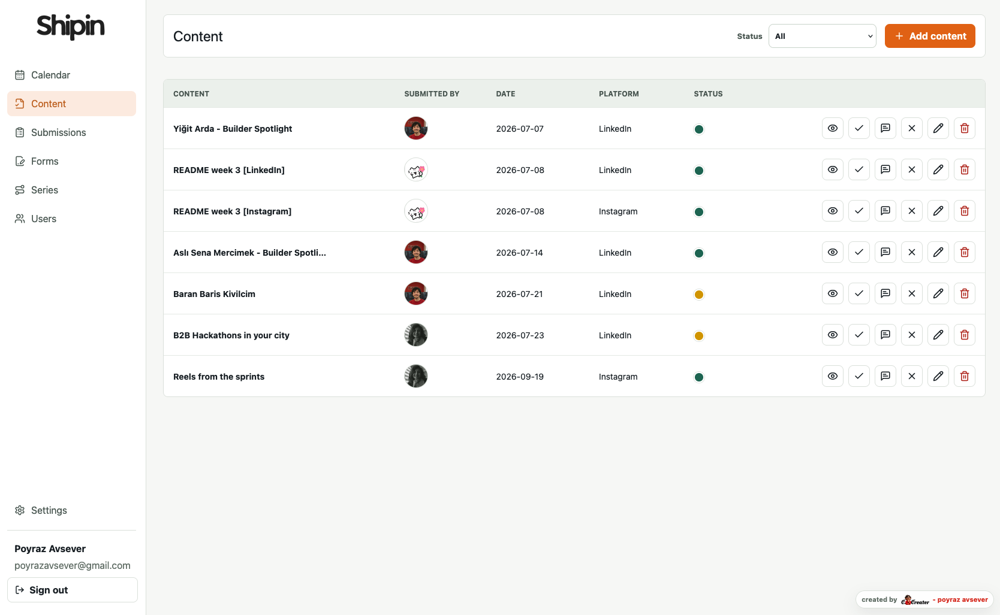

Bu yapı özellikle review sürecini görünür kılıyor. Bir içerik onay bekliyorsa listede bu açıkça görülüyor, revizyon gerekiyorsa da aynı yerden takip ediliyor. Yani takvim planlama içinse, liste ekranı operasyonun güncel durumunu taşıyor.

## Public Forms ve Submissions

CreatorOps'u yalnızca bir iç ekip aracı olmaktan çıkaran kısım public form akışı. Burada topluluk ya da dış katkı sahipleri belirli bir bağlantı üzerinden içerik gönderebiliyor.

Formlar sabit değil; seriye göre değişebiliyor, soru tipleri düzenlenebiliyor ve medya alanları eklenebiliyor. Böylece aynı sistem hem basit bir başvuru formu hem de daha zengin bir submission akışı olarak çalışabiliyor.

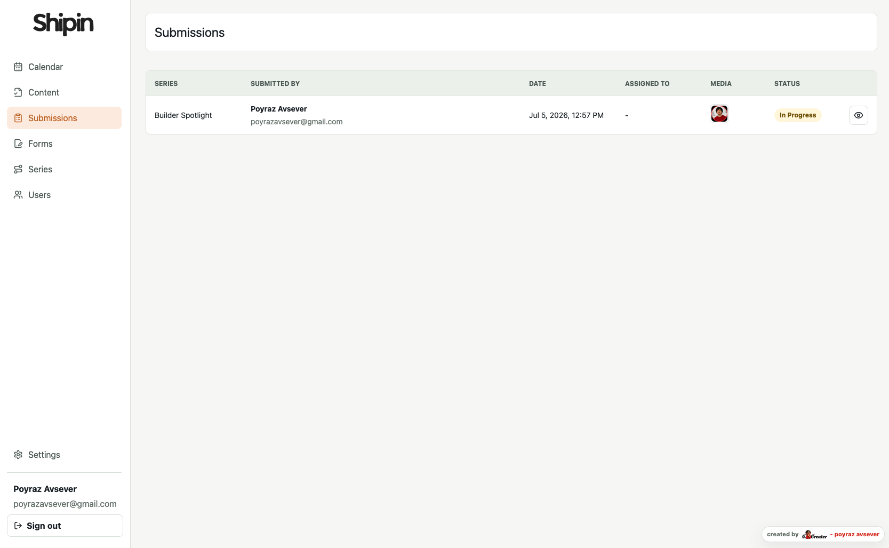

Submission geldikten sonra sistem bunu doğrudan operasyon akışına alıyor. Gerekli durumlarda atanıyor, review sürecine giriyor ve admin panelindeki listeye düşüyor. Bu yüzden public taraf ile admin tarafı aslında aynı ürünün iki yüzü gibi çalışıyor.

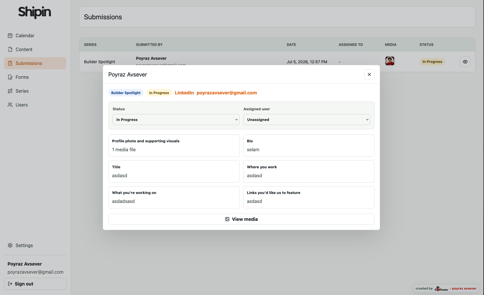

## Form Builder

Form tarafını güçlü yapan şey, şablonların sabit olmaması. Admin ekip yeni bir seri açtığında soruları tek tek tanımlayabiliyor, soru tiplerini değiştirebiliyor ve gerekli alanları özelleştirebiliyor.

Bu sayede CreatorOps, tek tip bir başvuru formundan çıkıp farklı içerik akışlarına uyum sağlayan bir yapı hâline geliyor. Bir seri için kısa başvuru alanı yeterliyken başka bir seri için medya, link ve açıklama alanları eklenebiliyor.

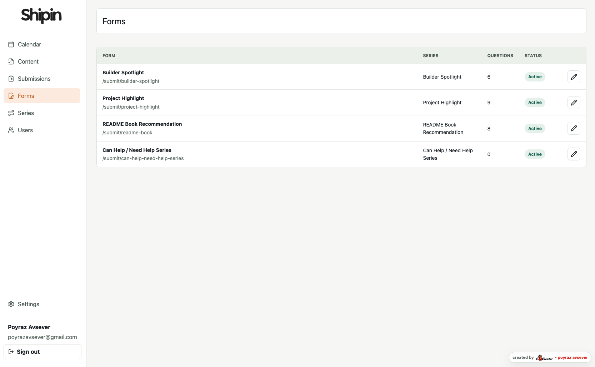

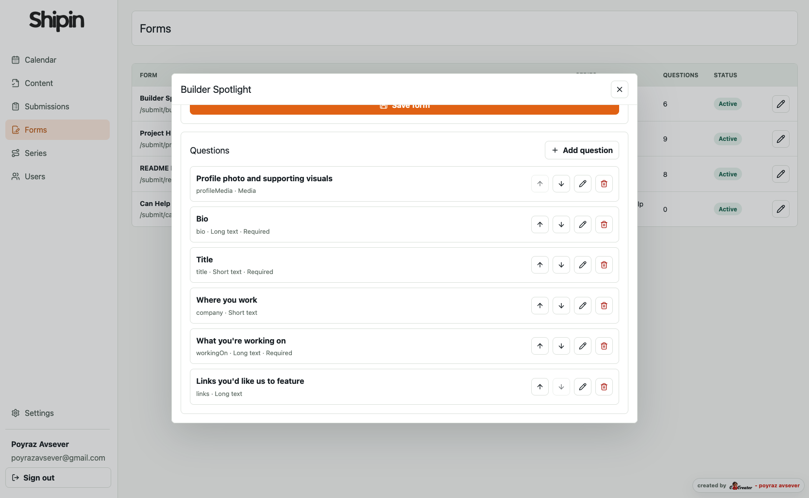

Bu katman önemli çünkü public submission tarafının ne toplayacağını aslında burası belirliyor. Yani form builder, sistemin esnekliğini taşıyan bölüm.

## Seriler ve Kullanıcılar

CreatorOps'ta seri kavramı önemli çünkü public form, submission ve assignment akışının merkezinde o var. Yeni bir seri açtığında yalnızca bir içerik etiketi oluşturmuyorsun; aynı zamanda o seriye bağlı formu, yayın akışını ve sorumlu kişileri de tanımlıyorsun.

Seri yönetimi bu yüzden sistemin operasyonel omurgası gibi çalışıyor. Bir seri aktif ya da pasif olabilir, edit edilebilir ve gerektiğinde atanan kullanıcılar güncellenebilir.

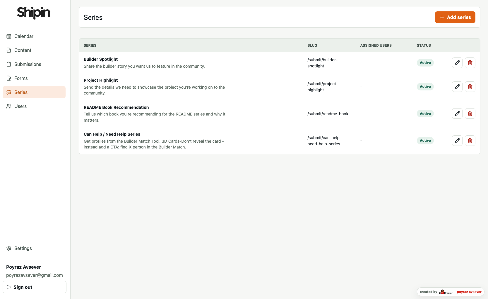

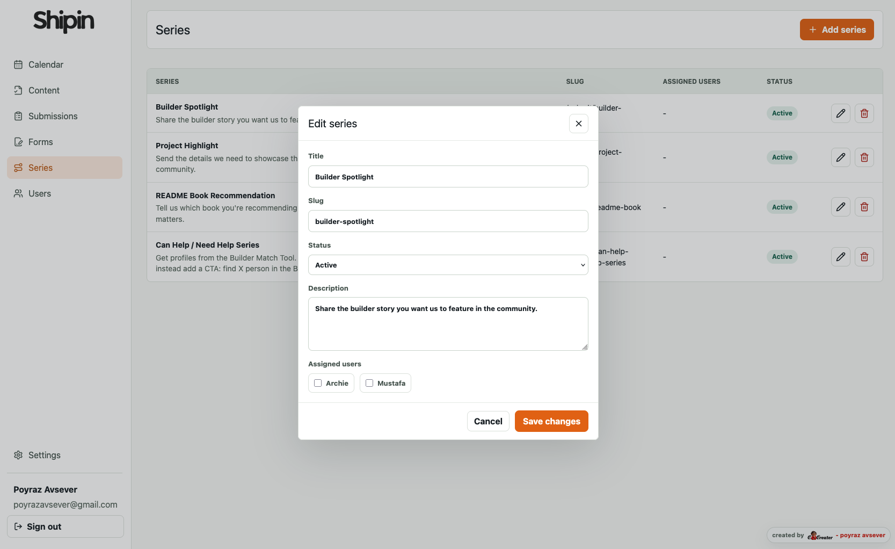

Kullanıcı tarafı ise bu akışın insan katmanı. Admin'ler kimlerin içerik üretebileceğini, kimlerin review yapabileceğini ve hangi rollerin aktif olacağını buradan yönetiyor.

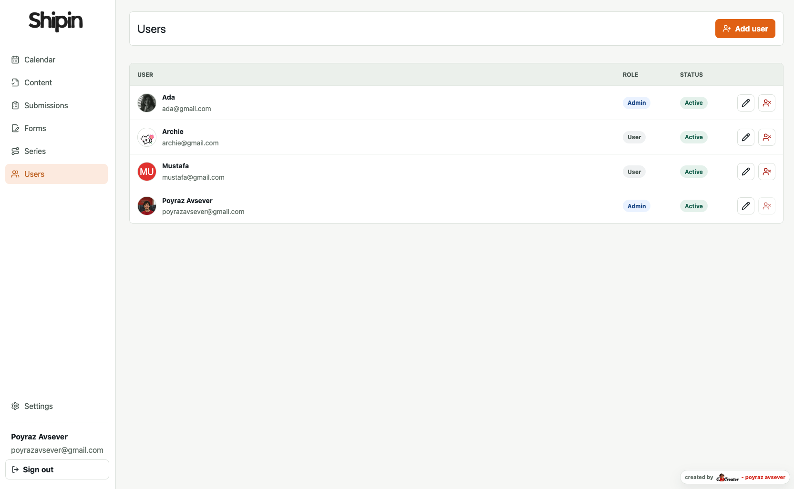

Bu bölüm, sistemin tek başına feature toplamaktan ibaret olmadığını gösteriyor. Çünkü içerik, form ve submission tarafı kadar ekip organizasyonu da ürünün bir parçası.

## Settings ve Branding

CreatorOps'un bir başka önemli tarafı da görünüm ve marka ayarları. Çünkü self-host bir araçta ürünün sadece çalışması yetmez; o aracın ekibin kimliğine de uyum sağlaması gerekir.

Bu bölümde logo, ana renk ve temel görünüm ayarları yönetiliyor. Böylece proje hazır bir panel gibi kalmıyor, kullanıldığı topluluğun parçası hâline geliyor.

Buradaki fikir basit: yönetim paneli, kullanan ekibin markasına göre özelleşebilmeli. Bu da özellikle Shipin gibi topluluk merkezli yapılarda önemli bir detay.

## Deployment ve Uploads

CreatorOps'un self-host tarafı burada netleşiyor. Uygulama Docker Compose ile ayağa kalkıyor, veritabanı PostgreSQL üzerinde duruyor ve dosyalar local filesystem'e yazılıyor.

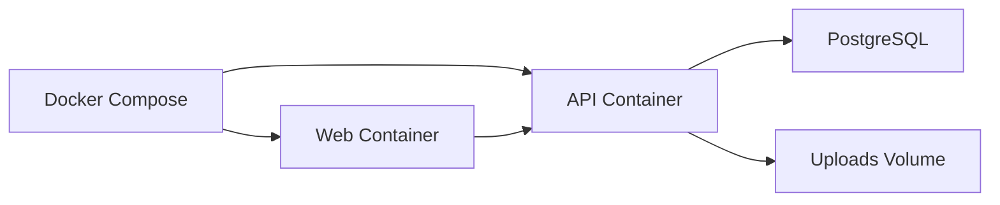

Prod ortamda nginx web'i servis ediyor ve API ile upload isteklerini içeri yönlendiriyor. API tarafı da startup sırasında migration çalıştırdığı için kurulum akışı mümkün olduğunca otomatik kalıyor.

Bu yaklaşımın avantajı basit: ekibi dışarıdaki bir servise bağımlı bırakmadan sistemi kendi domain'i ve kendi verisi üzerinde çalıştırabilmek.

## Şu An Üzerinde Çalıştığım Şey

Şu anda bu yapının üstüne otomatik platformlara publish etme katmanını eklemeye çalışıyorum. Yani içerik bir kez hazırlandıktan sonra sadece panel içinde kalmasın; doğrudan hedef platformlara gönderilebilsin istiyorum.

Bu benim için önemli bir sonraki adım çünkü CreatorOps'u sadece planlama ve review aracı olmaktan çıkarıp gerçek bir yayın operasyonu motoruna dönüştürüyor. Böylece içerik hazırlama, onay, medya yönetimi ve yayınlama tek akışta birleşmiş olacak.

Bu bölüm, projenin nereye evrileceğini göstermek için özellikle önemli. Çünkü şu ana kadar kurduğum yapı, ileride otomasyon, entegrasyon ve yayın orkestrasyonu için sağlam bir temel oluşturuyor.

## Kapanış

CreatorOps benim için tek bir ürün fikrinden daha fazlası oldu. Shipin topluluğunun bugünkü ihtiyaçlarından çıkan, ama aynı zamanda daha geniş bir creator-led operasyon modeline de uyum sağlayabilecek bir çekirdek hâline geldi.

Bu yazıda özellikle şunu göstermek istedim: bazen iyi bir araç, yalnızca daha fazla feature ekleyerek değil; problemi doğru modelleyerek, deployment'ı sade tutarak ve kullanıcı akışını netleştirerek oluşuyor. CreatorOps'u da tam olarak bu bakışla kurdum.

Şimdi sıra bu yapıyı publish otomasyonu ve entegrasyonlarla bir adım daha ileri taşımakta.

## Trade-off'lar

Bu yapının en net trade-off'u local upload storage kullanması. Bu, self-host için çok pratik ama ölçek büyüdükçe object storage gibi alternatifler gerektirebilir.

Bir diğer nokta da auth modelinin bilerek sade tutulmuş olması. Stateless token yapısı kurulumu kolaylaştırıyor, ama ileride oturum iptali ve merkezi revocation gibi ihtiyaçlar için ek mekanizma gerekebilir.

Yani CreatorOps bugün için hızlı kurulan, net çalışan ve sahiplenmesi kolay bir çekirdek. Ama özellikle publish entegrasyonları ve daha büyük ekip senaryoları geldikçe bazı parçaları büyütmek gerekecek.

## Son Not

Benim için bu projenin en güçlü tarafı, tek bir ekrana çok şey sığdırması değil; doğru problemi doğru yerde çözmeye çalışması. CreatorOps bu yüzden bir demo ürün gibi değil, kullanılabilir bir operasyon çekirdeği gibi tasarlandı.

Shipin tarafında bugün işe yarayan şey, yarın başka bir topluluğa da uyarlanabilecek bir yapıya dönüşebiliyorsa, bu proje hedefini bulmuş demektir. Asıl değer de burada başlıyor.

## Sonraki Adımlar

Bir sonraki aşamada odağım, publish entegrasyonlarını daha güvenli ve daha otomatik hâle getirmek.

Oradan sonra CreatorOps, sadece içerik hazırlanan bir yer olmaktan çıkıp yayınlanan, izlenen ve tekrar işletilebilen bir operasyon hattına dönüşecek.

## Kimler İçin?

Bu yazı ve bu ürün en çok, içerik üretimini tek başına değil ekip ve topluluk akışıyla birlikte yöneten insanlar için anlamlı.

Yani creator-led topluluklar, içerik operasyonu olan küçük ekipler ve self-host çalışmak isteyen proje sahipleri için CreatorOps'un çözmeye çalıştığı şey oldukça tanıdık: dağınık iş akışını tek yerde toplamak.

## Neden Bu Stack?

React ve Vite, panel tarafını hızlı ve sade tutmak için; Express ve Prisma ise domain kurallarını açık ve yönetilebilir tutmak için seçildi.

Docker da bu zinciri self-host senaryosunda taşınabilir hâle getirdi. Yani stack seçiminde amaç gösterişli olmak değil, kurulabilir ve sürdürülebilir kalmaktı.

## Ne Öğrendim?

Bu projede en net öğrendiğim şey, operasyonel bir aracın değerinin sadece feature sayısıyla ölçülmediği.

Asıl farkı yaratan şey; akışı sade tutmak, sistemi self-host kalacak kadar basit ama büyüyebilecek kadar düzenli kurmak ve insanların gerçekten kullanacağı detayları doğru yerde çözmek.

## Topluluk Tarafı

CreatorOps'un Shipin tarafında en anlamlı olduğu yer de burası. Araç, yalnızca ekibin içinden değil topluluğun içinden de beslenebildiğinde gerçek değerini gösteriyor.

Bu yüzden public form, review akışı ve assignment mantığı benim için ayrı ayrı feature'lar değil; toplulukla ekip arasında kurulan tek bir sistemin parçaları.
